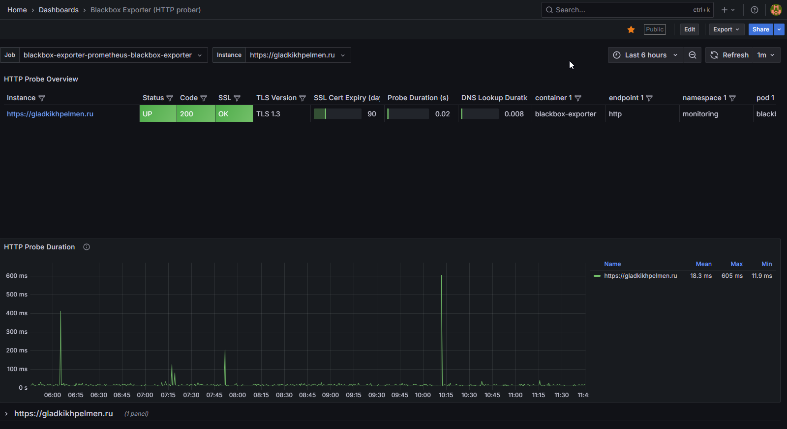
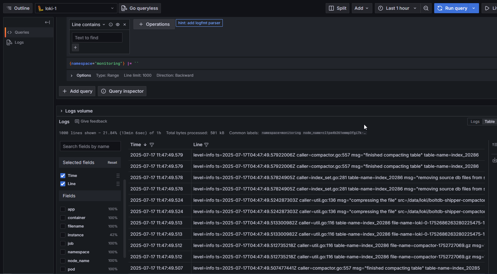

````markdown
# 🥟 Пельменная №2

Интернет-магазин пельменей с современной инфраструктурой на базе Kubernetes, Helm, Terraform, GitLab CI/CD и Yandex Cloud.

---

## 🌐 Доступ

- Приложение: https://gladkikhpelmen.ru/
- Мониторинг: https://grafana.gladkikhpelmen.ru/
- Grafana: `admin / admin`

---
## 📊 Дашборды и Логи

### Дашборд:


### Логи:


## 🚀 Развёртывание приложения (Docker + Helm)

### 🔧 Варианты:

#### 1. Через GitLab CI/CD (рекомендуется)
Сборка образов, публикация и деплой автоматизированы через `.gitlab-ci.yml`.

#### 2. Вручную (если CI недоступен)

##### Backend (Go):

```bash
cd backend
docker build -t gitlab.praktikum-services.ru:5050/std-ext-014-39/pelmennaya/backend:<VERSION> .
docker push gitlab.praktikum-services.ru:5050/std-ext-014-39/pelmennaya/backend:<VERSION>
````

##### Frontend (Vue + Nginx):

```bash
cd frontend
npm install
npm run build
docker build -t gitlab.praktikum-services.ru:5050/std-ext-014-39/pelmennaya/frontend:<VERSION> .
docker push gitlab.praktikum-services.ru:5050/std-ext-014-39/pelmennaya/frontend:<VERSION>
```

##### Деплой через Helm:

```bash
helm upgrade --install backend infrastructure/helm/charts/backend \
  --set image.repository=gitlab.praktikum-services.ru:5050/std-ext-014-39/pelmennaya/backend \
  --set image.tag=<VERSION>

helm upgrade --install frontend infrastructure/helm/charts/frontend \
  --set image.repository=gitlab.praktikum-services.ru:5050/std-ext-014-39/pelmennaya/frontend \
  --set image.tag=<VERSION>
```

---

## 📁 Об устройстве репозитория

```
pelmennaya/
├── backend/                # Go API
├── frontend/               # Vue SPA + Nginx
├── infrastructure/
│   ├── terraform/          # Инфраструктура в Yandex Cloud
│   ├── helm/               # Helm-чарты frontend/backend
│   ├── monitoring/         # Loki, Prometheus, Grafana
│   └── cluster-issuer/     # ClusterIssuer для cert-manager
├── .gitlab-ci.yml          # Главный CI/CD пайплайн
└── README.md               # Документация
```

---

## ⚙️ Развёртывание инфраструктуры

Вся инфраструктура описана в `infrastructure/terraform/` с использованием Terraform.

### 1. Подготовка

Создать S3-бакет и `config.s3.tfbackend`:

```hcl
access_key = "..."
secret_key = "..."
bucket     = "terraform-state"
endpoint   = "storage.yandexcloud.net"
region     = "ru-central1"
key        = "terraform.tfstate"
```

### 2. Инициализация и деплой

```bash
cd infrastructure/terraform
terraform init --backend-config=config.s3.tfbackend --reconfigure
terraform apply
```

> При необходимости выполнить `terraform state import` для облака и папки.

---

## 📊 Мониторинг

Мониторинг разворачивается в namespace `monitoring`.

```bash
kubectl create ns monitoring

helm repo add prometheus-community https://prometheus-community.github.io/helm-charts
helm repo update
helm install monitoring prometheus-community/kube-prometheus-stack -n monitoring

helm repo add grafana https://grafana.github.io/helm-charts
helm upgrade --install loki grafana/loki-stack -n monitoring

kubectl apply -f infrastructure/monitoring/ingress-monitoring.yaml
```

---

## 🛠️ О правилах внесения изменений в инфраструктуру

* Каждое изменение — в отдельной ветке (`feature/monitoring`, `feature/helm`, `fix/tf-vars`)
* После ревью — мёрдж в `main`
* Вся инфраструктура описывается в коде (Terraform, Helm, YAML)
* Изменения применяются только через Git + CI
* Запрещено вносить "горячие" правки напрямую в кластер

---

## 🔁 О релизном цикле и правилах версионирования

* Разработка → `feature/*` → `main`
* CI/CD в `main` собирает и публикует Docker-образы и Helm-чарты
* Версии задаются вручную в `.gitlab-ci.yml` или в переменных

Примеры:

```
gitlab.praktikum-services.ru:5050/std-ext-014-39/pelmennaya/backend:1.0.0
gitlab.praktikum-services.ru:5050/std-ext-014-39/pelmennaya/frontend:1.0.0
```

* Helm-чарты публикуются в Nexus
* Повторная публикация одной и той же версии запрещена

